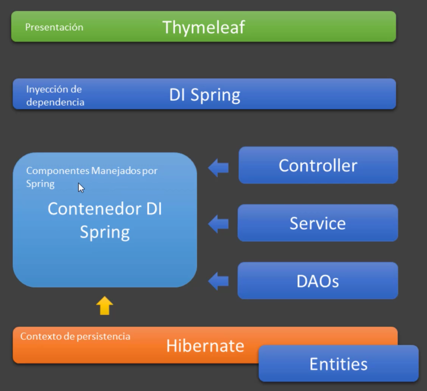

# INYECCION DE DEPENDENCIAS (IoC)

Características que se ven en esta app REST:

- CON INYECCION DE DEPENDENCIA

## Introducción al contenedor y la inyección de dependencias

- Inyección de dependencias consiste en suministrar a un objeto una referencia de otro(s) objeto(s) que necesite según la relación
  - Esta instancia se pasa como atributo (se inyecta)
- Resuelve el problema de reutilización y modularidad entre componentes
- Tanto el objeto al que le estamos inyectando como el objeto inyectado tienen que estar manejados por el contenedor, registrados, por ejemplo, utilizando la anotación `@Component`

- Cómo funciona:
  - El contenedor se encarga de gestionar las instancias y dependencias de componentes mediante la relación e inyección de objetos
    - Maneja por debajo un patrón llamado Service Locator
    - Es importante siempre tener un constructor sin parámetros, ya que por defecto, el contenedor va a crear estas instancias
      - Si estamos inyectando en un constructor usando @Autowired esto no es necesario
  - En contra-oposición de la creación explícita (operador new) de objetos
    - Los objetos entity si querremos crearlos con el operador new
  - Esto permite un bajo acoplamiento entre los objetos
  - Tiene que plasmarse mediante la anotación `@Autowired`



- Un DAO se va a inyectar en la clase Service
- Un Service se va a inyectar en la clase Controller
- Hibernate también se maneja, mediante un EntityManager, como componente Spring
- El EntityManager también se puede inyectar en las clases repositorio o DAO

- Anotación @Autowired

  - Especifica que se inyectará un objeto de Spring (bean o componente) en un atributo de otro objeto
    - Podemos usar @Autowired en: atributos, métodos setter y constructor (recomendado)
  - Es decir, para inyectar un bean de Spring en el componente actual (clase anotada y manejada por Spring)
  - Por defecto, la inyección falla si no encuentra candidatos disponibles

- Anotación `@Component` y sus derivados:

  - @Component es un estereotipo genérico para cualquier componente manejado por Spring
  - @Repository, @Service y @Controller son especializaciones de @Component para usos más específicos:
    - `@Repository` para persistencia, componentes que acceden a los datos (DAOs)
    - `@Service` para servicios de lógica de negocio
    - `@Controller` para controladores MVC

- Componentes o beans

  - El término "bean" se utiliza para referirse a cualquier componente manejado por Spring
  - Los beans deben ser anotados con la anotación @Component o sus derivados
  - Debe tener un constructor vacío por defecto, sin argumentos
    - Excepto que inyectemos en un constructor con @Autowired
  - Cualquier bean anotado con @Component (o derivados) bajo el package base serán instanciados y manejados por el contenedor DI de Spring (Auto-scanning)

- Anotaciones `@Configuration` y `@Bean`

  - Es otra forma de registrar componentes de Spring sin utilizar @Component
  - Una clase anotada con @Configuration indica que la clase puede ser utilizada por el contenedor Spring como una fuente de definiciones beans

  ```
      @Configuration
      public class AppConfig {

        @Bean
        public IUsuarioService registrarUsuarioService() {
          return new UsuarioServiceImpl();
        }
      }
  ```

  - Todo objeto que retornen estos métodos se van a guardar como componentes
  - Se le puede dar un nombre al componente: `@Bean("mi_nombre")`
  - Bean permite crear objetos y registrarlos en el contenedor usando métodos y usando el operador new, creando instancias de forma explícita
  - Por tanto, la anotación @Bean juega el mismo papel que anotar la clase con @Component
  - Lo definido anteriormente en la clase AppConfig sería equivalente a:

  ```
      @Component
      public class UsuarioService implements IUsuarioService {

      }
  ```

## Implementando inyección de dependencia con anotaciones @Autowired y @Component

- Documentación

  - https://martinfowler.com/articles/injection.html
  - https://docs.spring.io/spring-framework/reference/core/beans/introduction.html
  - https://docs.spring.io/spring-framework/reference/core/beans/dependencies/factory-collaborators.html
  - https://docs.spring.io/spring-framework/reference/core/beans/annotation-config/autowired.html

- Spring está basado en componentes, llamados beans, que tienen sus propios contextos (scope)
- Por defecto, el scope de un bean es singleton
- Anotamos nuestras clases ProductServiceImpl.java y ProductRepositoryImpl.java con la anotación @Component
- Spring detecta ahora que son componentes, con lo que su ciclo de vida lo gestionará el contenedor de Spring, creando una instancia de cada uno (scope singleton) e inyectándolos cuando lo necesitemos
- Anotamos con @Autowired el atributo ProductRepositoryImpl que se encuentra en ProductServiceImpl.java, para que el contenedor de Spring lo inyecte automáticamente
- Anotamos con @Autowired el atributo ProductServiceImpl que se encuentra en SomeController.java, para que el contenedor de Spring lo inyecte automáticamente
- PROBLEMA: Todavía queda muy acoplado, porque estamos inyectando IMPLEMENTACIONES CONCRETAS
- SOLUCION: Inyectar interfaces consigue el desacoplamiento
  - Por defecto, Spring busca una implementación de la interface. Si solo hay una, la inyecta. Si hay más de una es cuando tenemos que realizar una configuración para especificar cual inyectar, por ejemplo, usando @Qualifier

```
  En SomeController.java

  @Autowired
  private ProductService service;

  En ProductServiceImple.java

  @Autowired
  private ProductRepository repository;
```

## Las anotaciones @Repository y @Service

- Son estereotipos, es decir, tipos de componentes pero más refinados a una función concreta
- Cambiamos la anotación de ProductRepositoryImpl.java de @Component al estereotipo @Repository, que no deja de ser un componente, pero específico para acceso a datos (implementa patrón DAO y traduce excepciones para que sean más amistosas)
- Cambiamos la anotación de ProductServiceImpl.java de @Component al estereotipo @Service, que no deja de ser un componente, pero específico para lógica de negocio (implementa patrón Facade, pero es solo semántica, no tiene ningún añadido)

## Inyección de dependencias via métodos setter y constructor

- Inyectando mediante método setter. Ejemplo en ProductServiceImpl.java

```
  @Autowired
  public void setRepository(ProductRepository repository) {
    this.repository = repository;
  }
```

- Inyectando mediante constructor. Ejemplo en ProductServiceImpl.java
- No hace falta indicar @Autowired porque lo inyecta por defecto, siempre que solo haya un constructor y pasemos un componente de Spring
- Es la mejor forma de inyectar porque facilita el testing

```
  public ProductServiceImpl(ProductRepository repository) {
    this.repository = repository;
  }
```

## Anotación @Primary

- La anotación @Primary permite tener más de una implementación de una interface
- El contenedor de Spring inyectará aquella implementación que esté anotada con @Primary (solo puede anotarse en una)
- Creamos la clase ProductRepositoryFoo.java y la anotamos con @Repository y @Primary

```
  @Repository
  @Primary
  public class ProductRepositoryFoo implements ProductRepository {
  }
```

## Anotación @Qualifier

- Puede que queramos inyectar una implementación de una interface en una clase y otra implementación distinta en otra
- Con la anotación @Primary, solo se inyecta esa implementación
- Podemos seleccionar que implementación concreta se inyecta usando la anotación @Qualifier("nombre")
- El nombre, por defecto, es el nombre de la clase, pero empezando en minúsculas
  - Para la clase ProductRepositoryImpl.java, el nombre por defecto que hay que indicar en @Qualifier es productRepositoryImpl
- Ejemplo de inyección usando @Qualifier en ProductServiceImpl.java

```
  public ProductServiceImpl(@Qualifier("productRepositoryImpl") ProductRepository repository) {
      this.repository = repository;
  }
```

- También podemos cambiar el nombre con el que nos referimos al componente en el @Qualifier
- Para eso, en la anotación @Component y sus distintos estereotipos, podemos indicarle el nombre que le ponemos al componente
- Ejemplo en ProductRepositoryImpl.java

```
  @Repository("productList")
  public class ProductRepositoryImpl implements ProductRepository {
  }
```

- Y ahora, en ProductServiceImpl.java, indicamos como nombre en @Qualifier, productList

```
  public ProductServiceImpl(@Qualifier("productList") ProductRepository repository) {
    this.repository = repository;
  }
```

## El contexto RequestScope

- Podemos cambiar el scope por defecto singleton
- Lo vamos a cambiar a un scope de request, es decir, el ciclo de vida es una petición de usuario
- Para ello, anotamos nuestra clase ProductRepositoryImpl.java con la anotación @RequestScope
  - El ciclo de vida del repositorio dura un request, luego se destruye
  - Cuando se hace otro request, se vuelve a generar la instancia y se vuelve a inyectar

```
  @Repository("productList")
  @RequestScope
  public class ProductRepositoryImpl implements ProductRepository {
  }
```

## El contexto SessionScope

- Podemos cambiar el scope por defecto singleton
- Lo vamos a cambiar a un scope de session, es decir, el ciclo de vida dura una sesión http, hasta que cerramos el navegador o Postman
- No se suele usar mucho en API REST, está más pensado para aplicaciones web
- Para ello, anotamos nuestra clase ProductRepositoryImpl.java con la anotación @SessionScope
  - El ciclo de vida del repositorio dura lo que dura el navegador o Postman abierto, luego se destruye
  - Si abrimos otro navegador distinto o cerramos Postman y lo volvemos a abrir, se vuelve a generar la instancia y se vuelve a inyectar
- Un carro de compra o un login de usuario en un Spring MVC, por ejemplo, tendría un scope de session

```
  @Repository("productList")
  @SessionScope
  public class ProductRepositoryImpl implements ProductRepository {
  }
```

## Leer desde un archivo de configuración properties el valor tax

- Creamos un archivo properties llamado `config.properties` y creamos la siguiente propiedad: `config.tax.value=1.25d`
- En el package base, creamos la clase de configuración `AppConfig.java` (también se puede hacer usando @PropertySource en la clase SpringBootDiApplication.java)
- Anotamos con `@Configuration` y con `@PropertySource("classpath:config.properties")`

```
  @Configuration
  @PropertySource("classpath:config.properties")
  public class AppConfig {

  }
```

- En la clase ProductServiceImpl.java inyectamos el valor usando el tipo Environment (también se ha utilizado @Value para verlo como ejemplo) y anotado con @Autowired
- Environment también se puede pasar por el constructor

```
  1. Con Value

  @Value("${config.tax.value}")
  private double taxValue;

  Double priceWithTax = p.getPrice() * taxValue;

  2. Con Environment

  @Autowired
  private Environment environment;

  double tax = Optional.of(environment.getProperty("config.tax.value", Double.class)).orElse(1d);
  Double priceWithTax = p.getPrice() * tax;
```

## Creando clase que lee los datos de un archivo JSON

- El archivo JSON se debe encontrar en la carpeta resources. Creamos una carpeta json y dentro incluimos el archivo `product.json`
- El archivo JSON puede tener configuraciones, recursos, y se puede convertir a objetos
- Creamos un repository nuevo llamado `ProductRepositoryJson.java`
- Hay diferentes formas de leer un archivo JSON. Esta es una:
  - Usando la interface Resource: `Resource resource = new ClassPathResource("json/product.json");`
  - Después, usaremos un tipo ObjectMapper para mapear los datos leídos (un file o un Input String) a un objeto de Java
  - Poblamos la lista usando el objectMapper, método readValue()

```
    Resource resource = new ClassPathResource("json/product.json");
    ObjectMapper objectMapper = new ObjectMapper();
    try {
      list = Arrays.asList(objectMapper.readValue(resource.getFile(), Product[].class));
    } catch (StreamReadException e) {
      e.printStackTrace();
    } catch (DatabindException e) {
      e.printStackTrace();
    } catch (IOException e) {
      e.printStackTrace();
    }
```

## Registrando componente en clase anotada con @Configuration y la anotación @Bean

- La clase `ProductRepositoryJson.java` no está anotada con @Repository. La vamos a transformar en un componente de Spring usando una clase de configuración y un método que anotaremos con @Bean
- En la clase de configuración `AppConfig.java` añadimos el método `productRepositoryJson()` que devuelve un tipo ProductRepository (el genérico) y lo anotamos con @Bean
- La idea de usar clases de configuración para crear componentes de Spring es que tendremos que usar librerías de terceros cuyo código no podemos modificar, no pudiendo añadirles la anotaciones @Controller, @Service... correspondientes
- Al anotar con @Bean se puede omitir el modificador de acceso public
- Se puede anotar también con @Primary o darle un nombre al Bean para inyectarla en otro sitio
- Recordar que si no se indica el nombre, por defecto es el nombre del método, es decir, productRepositoryJson

```
  @Configuration
  @PropertySource("classpath:config.properties")
  public class AppConfig {

    @Bean("productJson")
    ProductRepository productRepositoryJson() {
      return new ProductRepositoryJson();
    }
  }
```

### Algunas variantes en el componente registrado con @Configuration y @Bean

- Vamos al fuente ProductRepositoryJson.java
- Podemos transformar esta inicialización programática `Resource resource = new ClassPathResource("json/product.json");` en una sentencia más declarativa, inyectándolo con @Value, pero no en esta clase que no es de Spring porque no está anotada con @Component, @Service... y no está en el contexto de Spring, sino en nuestra clase de configuración AppConfig.java, que si está en el contexto de Spring y podemos inyectar valores con @Autowired, @Value...
- Luego, en la creación de la instancia se pasa por constructor este atributo
- AppConfig.java queda:

```
  @Value("classpath:json/product.json")
  private Resource resource;

  @Bean("productJson")
  ProductRepository productRepositoryJson() {
    return new ProductRepositoryJson(resource);
  }
```

## Testing

Usamos Postman

- Listar todos los productos. GET: `http:\\localhost:8080\api`
- Buscar por producto. GET: `http:\\localhost:8080\api\1`
