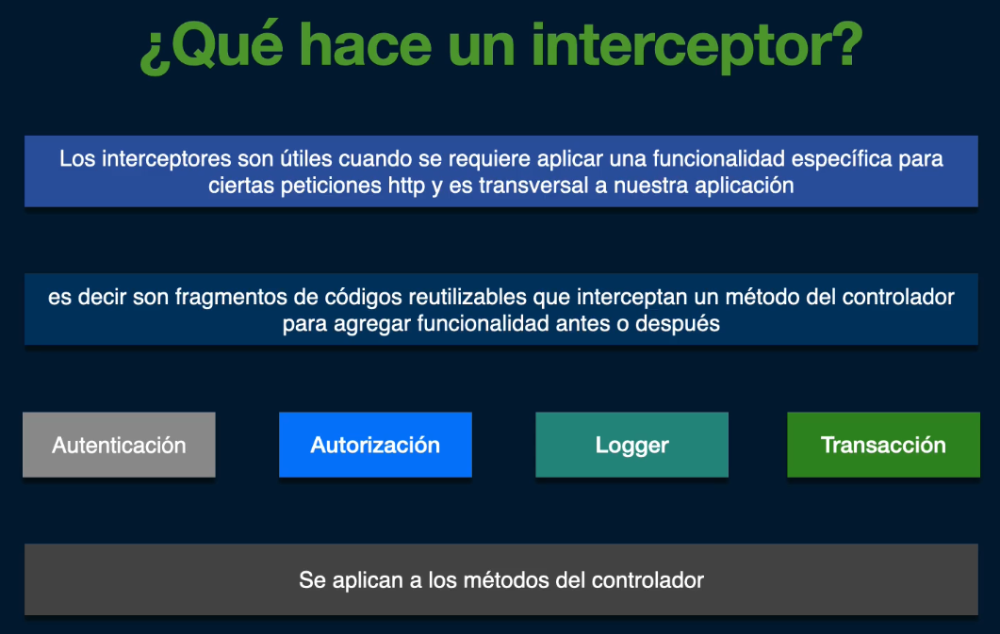
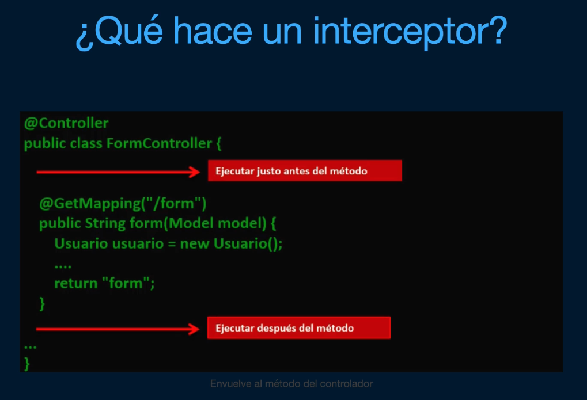

# INTERCEPTORES HTTP





## ¿Cómo funciona?

- Los interceptores deben implementar la interfaz HandlerInterceptor
- Se puede implementar el método boolean preHandler(), si queremos implementar una funcionalidad antes
  - Cuando este método retorna true, continua con la ejecución del controlador y si tiene más interceptores asociados continúa con la ejecución en cadena
  - Cuando este método retorna false, se asume que el interceptor se hace cargo del request, por ejemplo, redirige a una determinada vista o ruta, y no continúa con la ejecución del controlador ni de los demás interceptores, finaliza el request
- Se puede implementar el método void postHandler(), si queremos implementar una funcionalidad después de que se haya invocado el método handler del controlador
  - Se suele usar para guardar alguna información en el logger
- Se puede implementar el método void afterCompletion(), si queremos implementar algo cuando finaliza el proceso, es decir, después de cargar y renderizar la vista o el JSON, cuando se devuelve la respuesta al cliente

## Creación del Proyecto

Vamos a hacer un mini proyecto que va a usar interceptores para saber el tiempo que tarda un método de un controlador en cargar una página.

Hemos creado los packages controllers e interceptors en el raiz.

Algunas veces se crea el package interceptors dentro del package controllers, porque queremos indicar que esos interceptores interceptan al controlador.

Creamos el interceptor LoadingTimeInterceptor.java y lo anotamos con @Component para poderlo inyectar como interceptor de Spring.

## Registrando interceptor en la configuración de Spring

Si no se registra el interceptor no se podrá aplicar.

Para registrarlo creamos una clase de configuración, anotada con @Configuration, en el package principal, llamado MvcConfig, que implemente WebMvcConfigurer, y sobreescribimos el método addInterceptors() inyectando nuestro interceptor.

Con esto interceptará todas las rutas del controlador.

Si queremos interceptar solo algunas rutas del controlador, lo podemos indicar tras el método addInterceptor() indicando el método addPathPatterns() y pasándolo una lista de rutas.

También se pueden excluir rutas con el método excludePathPatterns(), de nuevo pasando una lista de rutas.

## Implementando Rest Controller

Creamos en el package controllers el controlador FooController.java y lo anotamos con @RestController

## Implementando interceptor TiempoTranscurrido

Podemos guardar cálculos del método preHandle() en el request, que luego podemos usar en el controlador o en el método interceptor postHandle()

```
    long start = System.currentTimeMillis();
    request.setAttribute("start", start);
```

Y luego, para recuperar ese valor en, por ejemplo, el método postHandle() `long start = (long) request.getAttribute("start");`

## Personalizando interceptor para incluir o excluir rutas

En la clase de configuración MvcConfig.java, clase addInterceptors, tras el método addInterceptor()

Se usa el método `addPathPatterns()` indicando las rutas separadas por comas, para incluir rutas a las que afecta el interceptor.

Ejemplo: `registry.addInterceptor(timeInterceptor).addPathPatterns("/app/bar", "/app/foo");`

Se usa el método `excludePathPatterns()` indicando las rutas separadas por comas, para excluir rutas y no las afecte el interceptor.

Ejemplo: `registry.addInterceptor(timeInterceptor).excludePathPatterns("/app/baz");`

Se puede usar, para indicar todas las rutas dentro de una, lo siguiente: `/app/**`

## Retornando false en un interceptor

Imaginemos que usamos un interceptor porque queremos validar un inicio de sesión y el usuario no ha hecho login.

Vamos a devolver false en el método preHandle(), evitando que se continue la ejecución, restringiendo el acceso al controlador y a los demás interceptores.

Para personalizar una respuesta cuando devolvemos false, antes de hacer su return, indicaremos el mensaje de respuesta como un JSON, es decir, crearemos nuestro Map<String, String> (por ejemplo) y luego tendremos que transformar manualmente a un texto con estructura JSON, usando ObjectMapper, y añadirlo a la respuesta.

Ejemplo:

```
    Map<String, String> json = new HashMap<>();
    json.put("error", "No tiene acceso a esta página!");

    // Para transformar manualmente a un texto con estructura JSON y pasarlo a la response de la petición
    ObjectMapper mapper = new ObjectMapper();
    String jsonString = mapper.writeValueAsString(json);
    response.setContentType("application/json");
    response.setStatus(HttpStatus.UNAUTHORIZED.value());
    response.getWriter().write(jsonString);

    return false;
```

## Qué temas se tratan

- Interfaz HandlerInterceptor
- Método postHandle()
- Método preHandle()
- @Component
- Logger
- LoggerFactory
- Clase de configuración anotado con @Configuration
- WebMvcConfigurer
- addInterceptors()
- @Autowired
- @Qualifier
- Controller anotado con @RestController
- @RequestMapping
- @GetMapping
- request.setAttribute()
- request.getAttribute()
- addPathPatterns()
- excludePathPatterns()
- ObjectMapper
- mapper.writeValueAsString()
- response.setContentType()
- response.setStatus()
- response.getWriter().write()

## Testing

Ejecutar cualquiera de estas rutas en Postman como un GET:

- `http://localhost:8080/app/foo`
- `http://localhost:8080/app/bar`
- `http://localhost:8080/app/baz`

Y ver la consola.

La ruta baz no ejecuta el interceptor porque se excluye esa ruta.
Si el delay random obtenido > 400 ms, se envía un error personalizado de interceptor.
