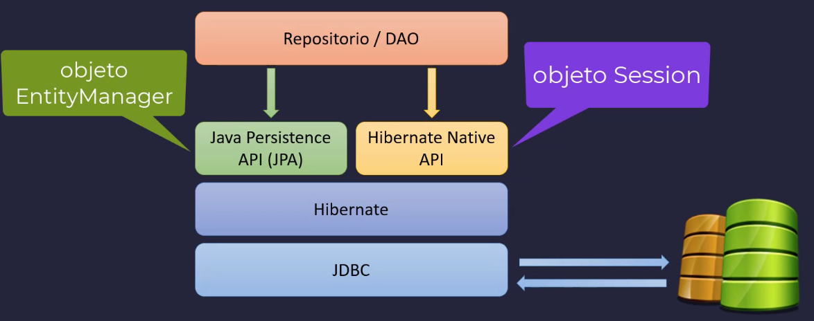
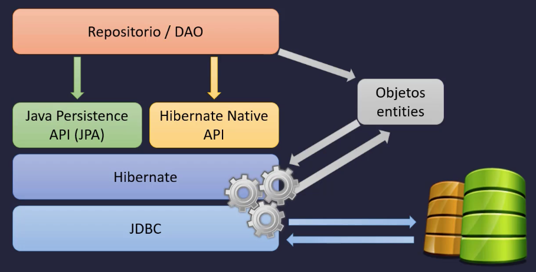
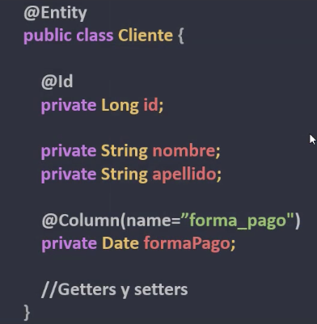

# JPA E HIBERNATE

https://docs.spring.io/spring-data/jpa/reference/jpa/query-methods.html

## Introducción a Hibernate

Es una herramienta de mapeo de objeto relacional (ORM) que permite trabajar los datos de una base de datos (RDBMS) en forma de clases y objetos (lenguaje POO)



- Repositorio/DAO: se encargan de acceder y operar con los datos
- Se puede trabajar:
  - Con Hibernate de forma nativa usando el objeto Session
  - Con JPA usando el objeto EntityManager
- El core de Hibernate, por detrás, no deja de ser JDBC, pero el mapeo es automático



- Los objetos Entity son los datos. Cada operación o consulta pasa por los objetos Entity

JPA es un conjunto de interfaces, una especificación que debe implementar un proveedor. Es el standard, una capa de abstracción sobre los proveedores.

Hibernate es una implementación concreta, un proveedor de JPA que implementa esta especificación.

Tanto en Hibernate como en JPA se pueden usar distintos tipos de consulta:

- Hibernate Query Language (HQL), que es un lenguaje propio de Hibernate
  - Es de tipo consulta, pero orientado a objetos
  - La consulta no se hace a la tabla, se hace al objeto Entity
  - Ejemplo: select c from Cliente c
  - También existe JPA Query Language (JPQL) que es el mismo standar
- Criteria API
  - Permite construir Sql de forma dinámica, de forma programática, mediante un conjunto de clases y métodos especiales
  - ```
      CriteriaQuery<Cliente> criteria = builder.createQuery(Cliente.class);
      Root<Cliente> root = criteria.from(Cliente.class);
      criteria.select(root);
      criteria.where(builder.equal(root.get(Person_.nombre), "John Doe"));
    ```
- Sql Nativo
  - Consulta directamente a las tablas
  - Se puede usar con JDBC
  - Se puede usar con Hibernate, con la ventaja de que lo mapea directamente al objeto Entity

Ejemplo de clase Entity:



Se informa la anotación @Entity para indicar que la clase es de JPA o Hibernate y que está asignada a una tabla que, si no se indica su nombre con la anotación @Table, buscará con el mismo nombre que el de la clase, Cliente en el ejemplo, mapeándola automáticamente.

Asociaciones entre las clases Entity

- @ManyToOne
- @OneToMany
- @OneToOne
- @ManyToMany

## Introducción a Spring Data JPA

https://docs.spring.io/spring-data/jpa/reference/jpa.html

Componente de Spring Boot que nos permite integrar y trabajar con JPA y con Hibernate en nuestras aplicaciones.

El API de persistencia de Java es un ORM. Consiste en trabajar con objetos que están mapeados a tablas, en vez de trabajar con consultas nativas. En la práctica esto crea una base de datos orientada a objetos virtual, sobre la base de datos relacional.

En este curso, en vez de trabajar directamente con Hibernate, vamos a trabajar con Spring Data JPA, que integra Hibernate (y por tanto JPA) a Spring.

Trabajaremos con interfaces y anotaciones, todo mucho más declarativo. O consultas generadas automáticamente a partir de nombres de métodos, ya sean los existentes de, por ejemplo CrudRepository, o creados por nosotros (Query Methods o anotación @Query)

Usaremos interfaces como CrudRepository, JpaRespository (combinación de CrudRepository y PagingAndSortingRepository) y UserRepository.

También podemos implementar nuestro propio Repository, heredando de CrudRepository, por ejemplo.

## Qué temas se tratan

- Clase principal implementa CommandLineRunner e implementamos el método run()
- Clase Entity anotada con @Entity para indicar que es una clase de persistencia y con @Table para cambiar el nombre de la tabla que mapea
- Mapeo de atributos de clase a campos de tabla de BBDD
  - Id usando anotaciones @Id y @GeneratedValue(strategy = GenerationType.IDENTITY) y demás campos usando anotación @Column
- Interface Repository
  - El nombre suele ser XxxxxRepository.java o XxxxxDao.java de acceso a datos que extiende de CrudRepository
- @Autowired
- Configurando propiedades de conexión a la BBDD y de JPA
  - En application.properties
  - ```
    spring.datasource.url=jdbc:mysql://localhost:3306/db_springboot
    spring.datasource.username=root
    spring.datasource.password=sasa1234
    spring.datasource.driver-class-name=com.mysql.cj.jdbc.Driver
    spring.jpa.database-platform=org.hibernate.dialect.MySQLDialect
    spring.jpa.show-sql=true
    ```
- Forma automática de crear tablas usando la configuración
  - En application.properties
  - ```
    # Creación de todo el lenguaje de definición de datos (DDL) de forma automática
    # Con el valor create, al arrancar el proyecto lee toda la metadata (anotaciones)
    # de nuestra clase entity, si existen las tablas las elimina y luego las crea de nuevo.
    # IMPORTANTE: SOLO PARA DESARROLLO Y TESTING!!
    spring.jpa.hibernate.ddl-auto=create
    # Y una vez se ha creado la tabla y ejecutado el script import.sql, para que no se
    # esté borrando/creando la tabla y la data, cambiarlo a update
    # Con update, si se crea un campo nuevo o una tabla nueva, si hace la creación de ese campo o tabla nueva.
    # IMPORTANTE: SOLO PARA DESARROLLO Y TESTING!!
    spring.jpa.hibernate.ddl-auto=update
    ```
- Ejecución automática de fichero import.sql en /src/main/resources con data para inicializar tablas
- Consultas personalizadas usando nomenclatura Query Methods (consulta basada en nombre de método)
- Consultas personalizadas con anotación @Query
- Devolviendo campos concretos y valores del objeto entity
  - Lo normal es recuperar todo el objeto y luego, usando los get del objeto, obtener el valor de lo que necesitamos
  - Pero se puede devolver valores de un objeto en vez del objeto
- Obtener un solo objeto con findById()
- Variante para obtener un solo objeto con consultas personalizadas con Query Methods
- Variante para obtener un solo objeto con consultas personalizadas con @Query
- Crear/actualizar registro en la base de datos, usando método automático del repository save()
- Scanner
- @Transactional anotado en métodos que hacen inserciones, actualizaciones y borrados en BBDD
- @Transactional(readOnly = true) en métodos que hacen lecturas de BBDD
- Eliminar registros con el método deleteById() del CrudRepository
- Eliminar registros con el método delete() del CrudRepository

## Testing

Correr la siguiente imagen de mysql:

```
  docker container run \
  -e MYSQL_USER=springstudent \
  -e MYSQL_PASSWORD=springstudent \
  -e MYSQL_ROOT_PASSWORD=sasa1234 \
  -e MYSQL_DATABASE=db_springboot \
  -dp 3306:3306 \
  --name db_springboot \
  --volume db_springboot:/var/lib/mysql \
  mysql:8.0
```

En Squirrel crear el siguiente alias

```
  Name: MySql_Docker
  Driver: MySQL Driver
  URL: jdbc:mysql://
  User Name: springstudent
  Password: springstudent

  Pulsar properties, y en la ventana que se abre, pulsar Driver properties.
  Hacer check en Use driver properties
  Hacer check en host e informar localhost
  Hacer check en port e informar 3306
  Hacer check en dbname e informar db_springboot
```

En application.properties, descomentar `spring.jpa.hibernate.ddl-auto=create` y comentar `spring.jpa.hibernate.ddl-auto=update`

En la ruta src/main/resources se encuentra un script llamado import.sql con datos a insertar para la tabla persons (en minúscula)
Spring lo ejecutará automáticamente.

Ejecutar el proyecto y en Squirrel ejecutar: `SELECT * FROM persons;`

En application.properties, comentar `spring.jpa.hibernate.ddl-auto=create` y descomentar `spring.jpa.hibernate.ddl-auto=update`, para que en las siguientes ejecuciones no borre la tabla/data existente.

Es una aplicación de consola, por lo que el resultado se ve en ella.

Hace inserciones/actualizaciones/borrados en BBDD usando la clase Scanner, es decir, que espera datos.
