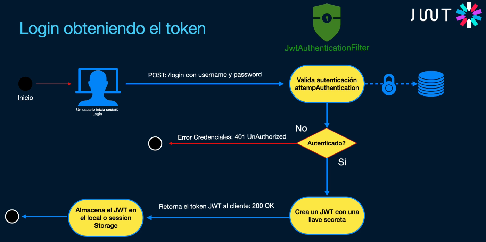
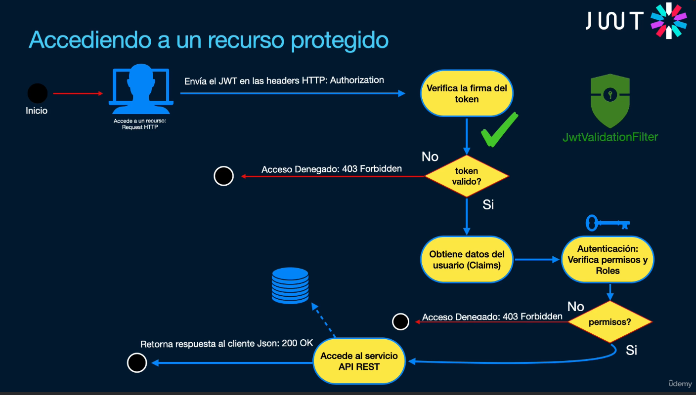

# Spring Security JWT

Vamos a ver autenticación JWT, basado en token para API Rest.

Para este ejemplo, se reutiliza el proyecto `19-springboot-crud`, pero aquí solo vamos a apuntar los temas nuevos que se tratan.

## Qué son los JSON Web Tokens

https://jwt.io/

https://github.com/jwtk/jjwt

JSON Web Tokens es un estándar abierto para implementar seguridad en nuestras aplicaciones API REST basado en la especificación RFC 7519.

Características:

- Son escalables. Pueden trabajar e integrarse en diferentes aplicaciones
- Codificado y decodificado en Base64. El usuario envía un token alfanumérico al backend, y este se encarga de decodificar dicho token y validarlo. Comprueba si existe el usuario y si tiene permisos a través de sus roles. Esto nos permite evitar tener que guardar sesiones en el servidor, con lo que este funcionará mucho más ligero
- Contienen reclamaciones (claims) que envía un cliente a un servidor. El servidor interpreta estas reclamaciones que contienen información del cliente como el username (el password NO va en el token, ni ninguna información sensible)
- Firmado mediante una llave secreta. Este estándar permite decodificar el token y verificar si es válido, y también se encarga de generar este token a través de una palabra o llave secreta que tenemos configurado en el servidor. El cliente no tiene que saber nuestra llave secreta, ya que es gracias a ella que se comprueba la autenticidad del token
- Compacto. Los JSON Web Token se pueden enviar a través de una petición web, generalmente y lo más recomendable en las cabeceras HTTP (Authorization) Como es muy pequeño, la transmisión es mucho más rápida
- Autónomo. Contiene toda la información sobre el usuario, evitando realizar consultas/inserciones en el servidor
- Seguridad. A pesar de que se verifica, se valida, esta firmado con una llave secreta, para asegurarse de que es auténtico está codificado en Base64, es decir, en doble vía. Por lo tanto, cualquiera puede leer su información y la puede manipular. Sin embargo, es completamente seguro, ya que cuando se envía un JSON Web Token al servidor, se que verifica la firma es la misma con la cual fue generado el token, usando la llave secreta, con lo cual se sabe si ha sido manipulado

Diagrama de flujo de como sería el proceso de Login para obtener el token:



Accediendo a un recurso protegido:



## Creando la estructura de tablas de la base de datos

Spring Security nos obliga a encriptar la contraseña. Usamos `bcrypt`, que es de una sola vía.

Por defecto, la tabla de usuarios debe llamarse `users` y la de roles `roles`. Se puede cambiar, pero para este proyecto crearemos manualmente dichas tablas.

Como es una relación Many to Many, vamos a crear una tabla intermedia `users_roles`.

También vamos a crear un par de Foreign Keys.

Creamos un par de roles. Es muy importante que los nombres de los roles sean en mayúscula y empiecen por `ROLE_`.

Los usuarios los vamos a crear más adelante, por programa, ya que el password debe estar encriptado.

El código de creación de las tablas puede verse en la parte de Testing, más abajo.

## UserDetailsService

Es un componente muy importante de Spring Security.

Es un servicio especial que permite ir a buscar al usuario por el username cuando realiza el login.

Aquí podemos implementar la forma en la que vamos a obtener el usuario, ya sea desde la BD, ya sea con JPA, con JDBC, si se va a leer desde un archivo de texto, se va a buscar a otro microservicio u otra API REST que esté desplegado en otro servidor.

Estamos personalizando nuestro login, la forma en la que validamos el username contra una fuente de datos.

Tendremos que crear el service e implementar el método `loadUserByUsername()` que devolverá un objeto del tipo `UserDetails` (es la interfaz, devuelve su implementación User, de Spring Security, no confundir con nuestro entity User, que es distinto) y se añade una lista de roles del tipo `Role` transformados a una lista del tipo `GrantedAuthority`.

Una vez creado este service, como estará registrado con @Service, cuando arranque la aplicación se va a registrar y se va a autoconfigurar en nuestra clase `SpringSecurityConfig.java`, quedando como parte del contexto de seguridad de Spring.

## Filtro JwtAuthenticationFilter para el login

Este filtro es muy importante para Spring Security y lo configuraremos después en el fuente `SpringSecurityConfig.java`.

Vamos a crear dos filtros.

Para estos filtros creamos, dentro del package `security`, otro package `filter`.

Para el primero de estos filtros, creamos el fuente `JwtAuthenticationFilter.java`.

Este filtro es para autenticarse mediante JWT, para hacer login, crear el token y devolvérselo al cliente. Vamos a enviar el user y el password desde nuestro Frontend y lo vamos a validar contra la BD utilizando nuestro `UserDetailsService`. También tenemos métodos para ejecutar en caso de que se haya autenticado correctamente e incorrectamente. Por último, tal y como dijimos más arriba, tenemos que configurar este filtro en nuestra configuración de Spring Security.

Para el segundo filtro creamos el fuente `JwtValidationFilter.java`

El segundo filtro es para validar el token, para autorizar. Tenemos que utilizarlo cada vez que querramos acceder a un recurso protegido para que nos deje acceder al mismo. Igualmente al finalizar lo configuramos en nuestra configuración de Spring Security.

## Añadiendo reglas de seguridad en la Configuración de Spring Security

Por ahora solo hemos añadido reglas para usuarios autenticados, pero no hemos especificado reglas para los distintos roles.

Por ejemplo, vamos a querer que solo los usuarios con role ROLE_ADMIN puedan dar de alta usuarios con role ROLE_ADMIN.

Estas validaciones se configuran de forma programática en nuestro fuente de configuración de seguridad `SpringSecurityConfig.java`.

Otra forma de configurar esto sería tener en Base de Datos una tabla para guardar las rutas URL, con su tipo (GET, POST...) y otra tabla con el rol asociado a esa ruta, conformando una relación ManyToMany.

También se pueden añadir reglas de seguridad usando anotaciones. En este caso, en vez de configurar `SpringSecurityConfig.java`, modificamos nuestros controladores (o nuestro service, es decir, podemos dar seguridad a un método del service) Todo lo que sea público lo dejamos con `.permitAll()` en `SpringSecurityConfig.java` mientras que los `.hasRole()` los administramos con anotaciones en nuestros controladores `ProductController.java` y `UserController.java`. Con esta forma de añadir autorizaciones no se puede configurar de forma dinámica usando tablas. Recordar que para que esto funcione, en la clase de configuración `SpringSecurityConfig.java` hay que indicar la anotación `@EnableMethodSecurity`.

## Configurando CORS para los clientes

Si tenemos un frontend en React o Angular que quiere acceder a nuestro backend, como está corriendo en otro puerto, al acceder a nuestro backend, como no coincide el dominio, va a dar un error de CORS (Intercambio de recursos de origen cruzado).

Para que no se produzca este error tenemos que realizar una configuración primero en el controlador y después en Spring Security.

En los dos controladores la hacemos con anotaciones, mientras que en Spring Security, nuestro `SpringSecurityConfig.java` lo tenemos que hacer de forma programática, configurando dos beans.

## Qué temas se tratan

- Entidad
  - @Entity
  - @Table
  - @Id
  - @GeneratedValue(strategy = GenerationType.IDENTITY)
  - Uso de anotación personalizada (ver más abajo lo que implica crearla)
  - @Column(unique = true)
  - @NotBlank
  - @Size
  - @JsonProperty
  - @JsonIgnore
  - @ManyToMany
  - @JoinTable
    - @JoinColumn
    - @UniqueConstraint
  - @Transient
  - @PrePersist
- Repository
  - CrudRepository
  - Optional
  - Consulta basada en nombre
- Clase Service
  - @Service
  - Inyección en constructor
  - @Transactional
  - Optional
    - ifPresent()
    - isEmpty()
  - PasswordEncoder
    - encode
  - implements UserDetailsService
    - UserDetails loadUserByUsername()
    - GrantedAuthority
      - SimpleGrantedAuthority
    - stream()
      - map()
      - collect()
        - Collectors.toList()
    - User (de Spring Security, no nuestra entity)
- Clase de Configuración para la seguridad
  - @Configuration
  - @EnableMethodSecurity(prePostEnabled = true)
  - @Bean
  - AuthenticationConfiguration
    - AuthenticationManager
  - PasswordEncoder
    - BCryptPasswordEncoder
  - Reglas de autorización
    - SecurityFilterChain
      - HttpSecurity
        - authorizeHttpRequests()
        - requestMatchers()
        - permitAll()
        - hasRole()
        - hasAnyRole()
        - authenticated()
        - csrf()
        - sessionManagement()
          - sessionCreationPolicy()
        - build()
  - CORS
    - CorsConfigurationSource
      - setAllowedOriginPatterns()
      - setAllowedMethods()
      - setAllowedHeaders()
      - setAllowCredentials()
      - UrlBasedCorsConfigurationSource
    - FilterRegistrationBean<CorsFilter>
      - CorsFilter()
      - setOrder()
- Clase Controller
  - @CrossOrigin()
    - origins
    - originPatterns
  - @RestController
  - @RequestMapping
  - Inyección en constructor
  - @GetMapping
  - @PreAuthorize("hasRole('ADMIN')")
  - @PreAuthorize("hasAnyRole('ADMIN', 'USER')")
  - @PostMapping
  - ResponseEntity
    - status(HttpStatus.CREATED)
    - body()
    - badRequest()
  - @Valid
  - @Validated
    - OnUpdate.class
    - OnCreate.class
  - @RequestBody
  - BindingResult
    - hasFieldErrors()
    - getFieldErrors()
    - getField()
    - getDefaultMessage()
- Anotación personalizada
  - @Constraint(validatedBy = ExistsByUsernameValidation.class)
  - @Target(ElementType.FIELD)
  - @Retention(RetentionPolicy.RUNTIME)
  - @interface
- Clase de Validación
  - @Component
  - implements ConstraintValidator
  - isValid()
- Filtros de seguridad
  - UsernamePasswordAuthenticationFilter
    - JwtAuthenticationFilter
    - AuthenticationManager
      - authenticate()
    - HttpServletRequest
    - HttpServletResponse
    - AuthenticationException
    - ObjectMapper()
      - readValue()
    - UsernamePasswordAuthenticationToken
  - SecretKey
  - Key
  - Authentication
    - getPrincipal()
- BasicAuthenticationFilter
  - AuthenticationManager
  - Claims
  - GrantedAuthority
  - ObjectMapper()
  - UsernamePasswordAuthenticationToken
  - SecurityContextHolder
- Uso de Mixin
  - @JsonCreator
  - @JsonProperty

## Testing

Correr la siguiente imagen de mysql:

```
  docker container run \
  -e MYSQL_USER=springstudent \
  -e MYSQL_PASSWORD=springstudent \
  -e MYSQL_ROOT_PASSWORD=sasa1234 \
  -e MYSQL_DATABASE=db_springboot \
  -dp 3306:3306 \
  --name db_springboot \
  --volume db_springboot:/var/lib/mysql \
  mysql:8.0
```

En Squirrel crear el siguiente alias:

```
  Name: MySql_Docker
  Driver: MySQL Driver
  URL: jdbc:mysql://
  User Name: springstudent
  Password: springstudent

  Pulsar properties, y en la ventana que se abre, pulsar Driver properties.
  Hacer check en Use driver properties
  Hacer check en host e informar localhost
  Hacer check en port e informar 3306
  Hacer check en dbname e informar db_springboot
```

Creamos las tablas de forma manual:

```
CREATE TABLE users (
 id BIGINT NOT NULL AUTO_INCREMENT,
 username VARCHAR(18) NOT NULL,
 password VARCHAR(60) NOT NULL,
 enabled TINYINT NOT NULL DEFAULT 1,
 PRIMARY KEY (id)
);

ALTER TABLE users ADD UNIQUE INDEX username_UNIQUE (username ASC) VISIBLE;

CREATE TABLE roles (
 id BIGINT NOT NULL AUTO_INCREMENT,
 NAME VARCHAR(45) NOT NULL,
 PRIMARY KEY (id)
);

ALTER TABLE roles ADD UNIQUE INDEX name_UNIQUE (name ASC) VISIBLE;

CREATE TABLE users_roles (
 user_id BIGINT NOT NULL,
 role_id BIGINT NOT NULL,
 PRIMARY KEY (user_id, role_id)
);

ALTER TABLE users_roles
ADD CONSTRAINT FK_users FOREIGN KEY (user_id) REFERENCES users(id)
  ON DELETE NO ACTION
  ON UPDATE NO ACTION,
ADD CONSTRAINT FK_roles FOREIGN KEY (role_id) REFERENCES roles(id)
  ON DELETE NO ACTION
  ON UPDATE NO ACTION;

INSERT INTO roles (name) values ('ROLE_ADMIN');
INSERT INTO roles (name) values ('ROLE_USER');

-- POR SI QUEREMOS QUE EL ID EMPIECE EN UN VALOR CONCRETO
ALTER TABLE users AUTO_INCREMENT = 3;
```

Para las pruebas en Postman, ir al archivo [Postman](./Postman/apiRestfulCrud.postman_collection.json)

En Postman probar las siguientes rutas (en este orden):

- Para ver usuarios tenemos este endpoint público
  - Users (GET público): http://localhost:8080/api/users
- Para registrar usuarios ROLE_USER tenemos este endpoint público también
  - Register Users (POST público): http://localhost:8080/api/users/register
- Para hacer login tenemos este endpoint público
  - Prueba de filtro Authentication (POST): http://localhost:8080/login
- Para registrar usuario con ROLE_ADMIN tenemos este endpoint privado
  - Users (POST Privado): http://localhost:8080/api/users
- Después se pueden probar los demás endpoints de Product, pero recordar que hay que hacer login con el usuario admin, que tiene rol ROLE_ADMIN. Un usuario con rol ROLE_USER solo puede usar el GET de productos.

JSON enviados en el POST Register

```
-- Ejemplo 1: Creación normal
{
    "username": "andres",
    "password": "12345"
}

-- Ejemplo 2: Aunque indique admin = true, en el código se pasa a false
{
    "username": "admin",
    "password": "12345",
    "admin": true
}

{
    "username": "pepe",
    "password": "12345",
    "admin": true
}

-- Ejemplo validación no permite crear dos veces el mismo username
{
    "username": "pepe",
    "password": "12345"
}

-- Ejemplo para hacer login correcto
{
    "username": "pepe",
    "password": "12345"
}

-- Ejemplo para hacer login incorrecto
{
    "username": "pepe_2",
    "password": "12345"
}
```

Y las consultas serán:

```
SELECT * FROM users;
SELECT * FROM roles;
SELECT * FROM users_roles;
```

Si tenemos que borrar un registro:

```
DELETE FROM users_roles WHERE user_id = 3;
DELETE FROM users WHERE id = 3;
```
